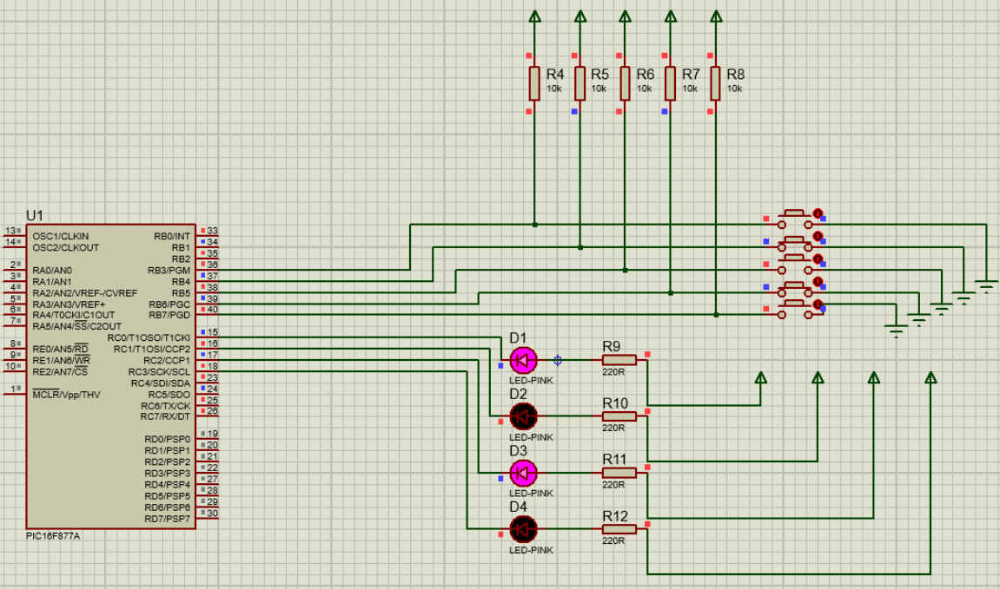
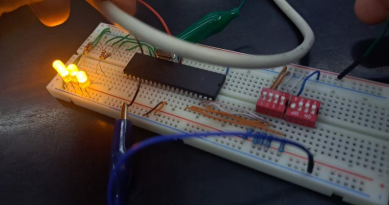

# 🔄 Práctica 5: Cambio de Posición - PIC16F877A

## 📋 Descripción

Este proyecto implementa un sistema de cambio de posición utilizando el microcontrolador **PIC16F877A**. El programa lee el nibble más significativo del **PORTB** (bits 4-7) y lo muestra en el nibble menos significativo del **PORTC** (bits 0-3), con o sin inversión según el estado del bit RB3.

### 🎯 Funcionalidad

- **PORTB** (bits 0-2, 4-7): Configurado como entrada para leer un valor de 8 bits
- **PORTB** (bit 3 - RB3): Se usa como selector de modo (5V = sin inversión, 0V = con inversión)
- **PORTC** (bits 0-3): Configurado como salida para mostrar el nibble más significativo del PORTB
- **Operación:** Toma el nibble alto del PORTB (bits 4-7) y lo muestra en el nibble bajo del PORTC (bits 0-3)

### 🔄 Funcionamiento

El programa implementa dos modos de operación según el estado del bit RB3:

**Modo ALTO (RB3 = 5V / 1):**
- Toma el nibble más significativo del PORTB (bits 4-7)
- Lo muestra directamente en el nibble menos significativo del PORTC (bits 0-3)
- Sin inversión

**Modo BAJO (RB3 = 0V / 0):**
- Toma el nibble más significativo del PORTB (bits 4-7)
- Lo invierte mediante XOR con `00001111`
- Lo muestra en el nibble menos significativo del PORTC (bits 0-3)

**Ejemplo:**
- Si `PORTB = 11010010` (nibble alto = 1101) y `RB3 = 5V` → `PORTC = XXXX1101` (muestra 1101)
- Si `PORTB = 11010010` (nibble alto = 1101) y `RB3 = 0V` → `PORTC = XXXX0010` (muestra 1101 invertido = 0010)

## 📖 Instrucción de la Práctica

Utilizar el Puerto B como entrada, utilizar el nibble menos significativo del Puerto C como salida. Si en el RB3 se encuentran 5V, mostrar en el nibble menos significativo del Puerto C el valor del nibble más significativo del puerto B. Si en el RB3 se encuentran 0V mostrar en el nibble menos significativo del Puerto C el valor del nibble más significativo del puerto B de manera invertida.

**Ejemplo:**
- Si `PORTB = 11010010` (nibble alto = 1101) y `RB3 = 5V` → `PORTC = XXXX1101` (muestra 1101 en bits 0-3)
- Si `PORTB = 11010010` (nibble alto = 1101) y `RB3 = 0V` → `PORTC = XXXX0010` (muestra 1101 invertido = 0010 en bits 0-3)

## 🔧 Tecnologías Utilizadas


## 🛠️ Materiales Necesarios

### Componentes Electrónicos

- 🔹 **1x Microcontrolador PIC16F877A**
- 🔹 **1x Cristal oscilador 4MHz** (o según configuración)
- 🔹 **2x Capacitores cerámicos 22pF** (para el cristal)
- 🔹 **1x Resistencia pull-up 10kΩ** (opcional, para MCLR)
- 🔹 **8x Interruptores o DIP switch** (para PORTB, bits 0-2, 4-7)
- 🔹 **1x LED o indicador** (para PORTB.3, opcional)
- 🔹 **8x LEDs** con resistencias limitadoras (220Ω - 1kΩ) para visualizar el resultado en PORTC
- 🔹 **8x Resistencias 220Ω - 1kΩ** (para los LEDs)
- 🔹 **1x Capacitor electrolítico 100µF** (filtro de alimentación)
- 🔹 **1x Capacitor cerámico 0.1µF** (desacoplamiento)
- 🔹 **Fuente de alimentación 5V DC** o regulador 7805
- 🔹 **Cables dupont o protoboard** para conexiones

### Herramientas y Software

- 💻 **MPLAB X IDE** o **MPLAB IDE**
- 🔧 **Compilador XC8** o **MPASM**
- 📡 **Programador PIC** (PICKit, ICD, etc.)
- 🔌 **Proteus ISIS** o **Proteus Professional** (para simulación)
- 📐 **Protoboard** o **PCB** para montaje
- 🔨 **Soldador** (si se usa PCB)

## 📁 Estructura del Proyecto

```
practica(5)/
├── README.md                    # Este archivo
├── pract5.pdsprj               # Proyecto de Proteus
├── practica5.X/
│   └── prac5.asm               # Código fuente en ensamblador
└── dist/
    └── default/
        └── production/
            └── practica5.X.production.hex  # Archivo HEX para programar
```

## 💻 Código

El código está escrito en **ensamblador PIC** y está completamente comentado línea por línea para facilitar su comprensión.

### Características del Código

- ✅ Configuración de puertos (PORTB como entrada parcial, PORTC como salida)
- ✅ Manejo de bancos de memoria del PIC
- ✅ Intercambio de nibbles mediante instrucción SWAPF
- ✅ Operación XOR para inversión de bits
- ✅ Subrutinas modulares según el estado de RB3
- ✅ Bucle principal infinito para lectura continua
- ✅ Comentarios descriptivos en cada línea

### Algoritmo de Cambio de Posición

El programa implementa el cambio de posición de la siguiente manera:

**Modo ALTO (RB3 = 5V / 1):**
```assembly
nibble_alto = PORTB[7:4]  // Bits 4-7 del PORTB
PORTC[3:0] = nibble_alto  // Muestra en bits 0-3 del PORTC
```

**Modo BAJO (RB3 = 0V / 0):**
```assembly
nibble_alto = PORTB[7:4]  // Bits 4-7 del PORTB
nibble_invertido = nibble_alto XOR 00001111
PORTC[3:0] = nibble_invertido  // Muestra invertido en bits 0-3 del PORTC
```

## 🚀 Instalación y Uso

### 1. Clonar el Repositorio

```bash
git clone https://github.com/LuisMatla/cambioposicion.git
cd cambioposicion
```

### 2. Abrir en MPLAB X

1. Abre **MPLAB X IDE**
2. File → Open Project
3. Selecciona el proyecto `practica5.X` o importa el proyecto

### 3. Compilar el Proyecto

1. Build → Build Main Project (F11)
2. Verifica que no haya errores en la compilación
3. El archivo `.hex` se generará en `dist/default/production/`

### 4. Programar el PIC

1. Conecta tu programador PIC al microcontrolador
2. Tools → Select Tool → [Tu Programador]
3. Production → Build and Program Main Project
4. Espera a que termine la programación

### 5. Simular en Proteus (Opcional)

1. Abre `pract5.pdsprj` en **Proteus ISIS**
2. Ejecuta la simulación
3. Prueba cambiando los valores en PORTB y observa el resultado en PORTC

## 🔧 Configuración del Hardware

### Conexiones PORTB (Entradas y Control)

Los bits del PORTB se configuran de la siguiente manera:

```
PORTB.0 → DIP Switch bit 0 o Interruptor 1 (entrada)
PORTB.1 → DIP Switch bit 1 o Interruptor 2 (entrada)
PORTB.2 → DIP Switch bit 2 o Interruptor 3 (entrada)
PORTB.3 → LED o indicador (salida - selector de modo)
PORTB.4 → DIP Switch bit 4 o Interruptor 4 (entrada)
PORTB.5 → DIP Switch bit 5 o Interruptor 5 (entrada)
PORTB.6 → DIP Switch bit 6 o Interruptor 6 (entrada)
PORTB.7 → DIP Switch bit 7 o Interruptor 7 (entrada)
```

### Conexiones PORTC (Salidas)

El PORTC muestra el resultado en el nibble menos significativo (bits 0-3):

```
PORTC.0 → LED 0 (con resistencia 220Ω) → GND (bit menos significativo)
PORTC.1 → LED 1 (con resistencia 220Ω) → GND
PORTC.2 → LED 2 (con resistencia 220Ω) → GND
PORTC.3 → LED 3 (con resistencia 220Ω) → GND (bit más significativo del nibble)
PORTC.4 → No utilizado
PORTC.5 → No utilizado
PORTC.6 → No utilizado
PORTC.7 → No utilizado
```

### Alimentación

```
VDD (Pin 11, 32) → +5V
VSS (Pin 12, 31) → GND
```

### Oscilador

```
OSC1 (Pin 13) → Cristal 4MHz
OSC2 (Pin 14) → Cristal 4MHz
Capacitores 22pF desde cada pin a GND
```

### Configuración de Fusibles

El programa configura los siguientes fusibles:

- **WDT:** Deshabilitado (Watchdog Timer OFF)
- **PWRTE:** Habilitado (Power-up Timer ON)
- **OSC:** Oscilador XT (Cristal)
- **LVP:** Deshabilitado (Low Voltage Programming OFF)
- **CP:** Deshabilitado (Code Protection OFF)

## 🖥️ Simulación del Circuito

A continuación se muestra el circuito simulado en **Proteus ISIS**:



**Descripción del Circuito Simulado:**

El circuito muestra el microcontrolador **PIC16F877A** conectado a:

- **5 Pulsadores (Button 1-5):** Conectados al PORTB (RB0-RB4) con resistencias pull-up de 10kΩ. Cada pulsador tiene una resistencia pull-up conectada a VCC y el otro terminal del pulsador conectado a GND. Cuando un pulsador no está presionado, el pin del PORTB está en estado alto (5V). Al presionar el pulsador, el pin se conecta a GND, resultando en estado bajo (0V).

- **4 LEDs Rosas (D1-D4):** Conectados al PORTC (RC0-RC3) con resistencias limitadoras de 220Ω. Los LEDs están configurados en modo activo bajo (active-low), donde el ánodo está conectado al pin del PORTC y el cátodo está conectado a VCC a través de la resistencia. Los LEDs se encienden cuando el pin del PORTC está en estado bajo (0V).

**Componentes del Circuito:**
- Microcontrolador PIC16F877A (U1)
- 5 Pulsadores (Button 1-5)
- 5 Resistencias pull-up de 10kΩ (R4-R8)
- 4 LEDs rosas (D1-D4)
- 4 Resistencias limitadoras de 220Ω (R9-R12)
- Alimentación VCC (+5V) y GND
- Pin MCLR conectado a VCC

**Funcionamiento:**
- El PORTB (bits 0-4) lee el estado de los pulsadores
- El bit RB3 se usa como selector de modo (5V = sin inversión, 0V = con inversión)
- El PORTC (bits 0-3) muestra el nibble más significativo del PORTB, con o sin inversión según RB3

## ✅ Sistema Funcionando

A continuación se muestra el circuito físico montado en protoboard y funcionando correctamente:



**Descripción del Sistema Físico:**

El circuito está montado en una protoboard y muestra:

- **Microcontrolador PIC16F877A:** Montado en el centro de la protoboard con sus 40 pines conectados correctamente.

- **Cristal Oscilador 4MHz:** Conectado a los pines 13 y 14 del PIC, con dos capacitores cerámicos de 22pF conectados a tierra.

- **4 LEDs:** Conectados al PORTC (RC0-RC3) del PIC, cada uno con su resistencia limitadora de 220Ω. Los LEDs se encienden según el resultado de la operación, mostrando el nibble más significativo del PORTB en el nibble menos significativo del PORTC.

- **Pulsadores o DIP Switches:** Conectados al PORTB (RB0-RB4) del PIC, permitiendo configurar el valor de entrada. El bit RB3 se usa como selector de modo.

- **Conexiones de Alimentación:** Cables rojo y negro conectados a los rieles de alimentación de la protoboard (+5V y GND).

**Estado del Sistema:**
El sistema está funcionando correctamente, leyendo el nibble más significativo del PORTB y mostrándolo en el nibble menos significativo del PORTC, con o sin inversión según el estado del bit RB3.

## 📊 Tabla de Valores

### Modo ALTO (RB3 = 5V / 1) - Sin Inversión

| Entrada PORTB | Nibble Alto (bits 4-7) | Salida PORTC (bits 0-3) | Decimal |
|---------------|------------------------|--------------------------|---------|
| 1101XXXX      | 1101                   | 1101                     | 13      |
| 1010XXXX      | 1010                   | 1010                     | 10      |
| 1111XXXX      | 1111                   | 1111                     | 15      |
| 0000XXXX      | 0000                   | 0000                     | 0       |
| 0101XXXX      | 0101                   | 0101                     | 5       |

### Modo BAJO (RB3 = 0V / 0) - Con Inversión

| Entrada PORTB | Nibble Alto (bits 4-7) | Invertido (XOR 1111) | Salida PORTC (bits 0-3) | Decimal |
|---------------|------------------------|----------------------|--------------------------|---------|
| 1101XXXX      | 1101                   | 0010                 | 0010                     | 2       |
| 1010XXXX      | 1010                   | 0101                 | 0101                     | 5       |
| 1111XXXX      | 1111                   | 0000                 | 0000                     | 0       |
| 0000XXXX      | 0000                   | 1111                 | 1111                     | 15      |
| 0101XXXX      | 0101                   | 1010                 | 1010                     | 10      |

## 🧪 Pruebas

### Prueba Básica

1. ✅ Alimenta el circuito con 5V
2. ✅ Configura el DIP switch en PORTB con un valor (ej: 11010010)
3. ✅ Configura RB3 en 0 (modo BAJO) y verifica el resultado en PORTC
4. ✅ Configura RB3 en 1 (modo ALTO) y verifica el resultado en PORTC
5. ✅ Compara los resultados de ambos modos

### Ejemplo de Prueba

- **Entrada:** PORTB = `11010010` (nibble alto = `1101`)
- **Modo ALTO (RB3 = 5V / 1):**
  - Nibble alto del PORTB: `1101`
  - **Salida esperada:** PORTC = `XXXX1101` (bits 0-3 = 1101, decimal 13)
- **Modo BAJO (RB3 = 0V / 0):**
  - Nibble alto del PORTB: `1101`
  - Invertido (XOR 1111): `0010`
  - **Salida esperada:** PORTC = `XXXX0010` (bits 0-3 = 0010, decimal 2)

## 📝 Notas Técnicas

- El programa utiliza un **bucle infinito** para leer continuamente las entradas
- La operación de intercambio se realiza mediante la instrucción **SWAPF** (intercambia nibbles)
- El código maneja correctamente los **bancos de memoria** del PIC16F877A
- La configuración de puertos se realiza en el **banco 1** (TRISB, TRISC)
- Las operaciones de lectura/escritura se realizan en el **banco 0** (PORTB, PORTC)
- Se utiliza la operación **XOR** para invertir los bits menos significativos en modo BAJO
- El bit RB3 actúa como selector de modo (0 = BAJO con inversión, 1 = ALTO sin inversión)

## 👨‍💻 Autores

**Luis Fernando Contreras Matla.**

**Samuel Obed García Velandia.**

## 📚 Información Académica

Esta práctica fue desarrollada como parte de la Experiencia Educativa:

- **Materia:** Microprocesadores y Microcontroladores
- **Universidad:** Universidad Veracruzana
- **Facultad:** Ingeniería Eléctrica y Electrónica
- **Docente:** Rosa María Woo García

## 📄 Licencia

Este proyecto es de uso educativo y académico.

